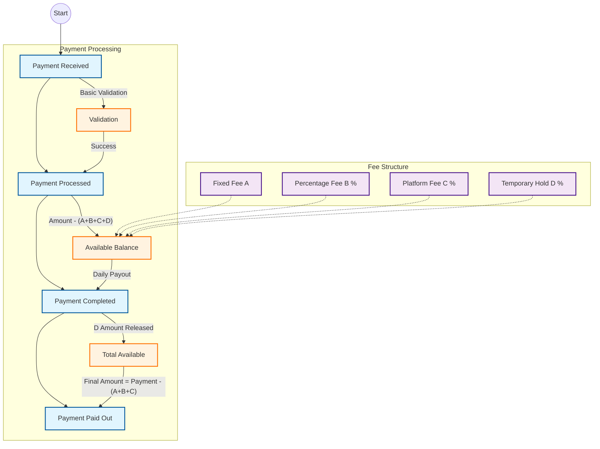

# Payment Processing Flow

```mermaid
graph TB
    %% Payment States
    Start((Start)) --> Received[Payment Received]
    Received --> Processed[Payment Processed]
    Processed --> Completed[Payment Completed]
    Completed --> PaidOut[Payment Paid Out]

    %% Fee Calculations
    subgraph "Fee Structure"
        FeeA[Fixed Fee A]
        FeeB[Percentage Fee B %]
        FeeC[Platform Fee C %]
        FeeD[Temporary Hold D %]
    end

    %% Payment Processing Details
    subgraph "Payment Processing"
        Received --> |Basic Validation|V[Validation]
        V --> |Success|Processed
        Processed --> |"Amount - (A+B+C+D)"|Balance[Available Balance]
        Balance --> |Daily Payout|Completed
        Completed --> |"D Amount Released"|UnlockedBalance[Total Available]
        UnlockedBalance --> |"Final Amount = Payment - (A+B+C)"|PaidOut
    end

    %% Styling
    classDef state fill:#e1f5fe,stroke:#01579b,stroke-width:2px;
    classDef process fill:#fff3e0,stroke:#ff6f00,stroke-width:2px;
    classDef fee fill:#f3e5f5,stroke:#4a148c,stroke-width:2px;

    class Received,Processed,Completed,PaidOut state;
    class V,Balance,UnlockedBalance process;
    class FeeA,FeeB,FeeC,FeeD fee;

    %% Relationships
    FeeA -.-> Balance
    FeeB -.-> Balance
    FeeC -.-> Balance
    FeeD -.-> Balance
```